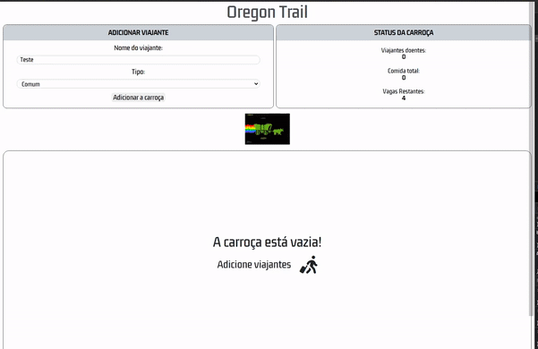

<!-- PROJECT LOGO -->
 

<h1 align="center">Oregon Trail </h1>

  

    Baseado no jogo The Oregon Trail, é uma aplicação em que o usuário escolhe quantos vagões terá a sua carroça, e nela consegue adicionar três tipos de viajantes numa carroça. Cada viajante possui ações específicas, podendo ser a de caçar comida, comer e/ou curar. Desenvolvido utilizando Programação Orientada a Objetos. 
    <a href="https://guiwustro.github.io/oregon-trail-game/">Link do projeto</a>

  

## Sobre o projeto

Essa aplicação é composta por duas páginas, a primeira, o usuário deve escolher,
o número de vagões que a carroça deverá ter e assim que escolhida, o usuário é
redirecionado para página do jogo.  

Na página do jogo, o usuário é capaz de adicionar novos viajantes ao vagão. É
disparado um erro, caso o usuário não digite um nome para o viajante, digite um
nome com mais de 15 caracteres ou tente adicionar viajantes sem possuir vagas na
carroça.  

Cada tipo de viajante tem seu cartão personalizado, tendo ações específicas para
cada tipo de viajante.  

A aplicação possui um espaço específico em que mostra o Status da carroça, ou
seja, o número de viajantes doentes, a comida total e as vagas restantes.

## Tecnologias utilizadas

O projeto foi realizado utilizando somente JS, HTML e CSS. Desenvolvido
utilizando Programação Orientada a Objetos.

## Usabilidade

## Features

- [x] Escolha do número de vagões (até 20);
- [x] Formulário para o usuário cadastrar novos viajantes
- [x] Modais de notificação ao usuário, avisando ao usuário em casos de:
      viajante adicionado não possui nome definido, possui mais de 15 caractéres
      ou não há mais espaço na carroça;
- [x] Uma vitrine contendo todos os viajantes adicionados;
- [x] Card personalizado acordo com o tipo do viajante adicionado;
- [x] Ação de comer e caçar para o viajante comum;
- [x] Ação de comer, caçar e transferir comida para o Caçador;
- [x] Ação de comer, caçar e curar outro viajante para o Doutor;
- [x] Responsivo para todas as telas;
- [x] Modais de notificação ao usuário em caso de transferência de comida sem
      ter a comida suficiente, comer doente, entre outros;
- [x] Botão para voltar ao menu inicial para criar outra carroça do zero,
      escolhendo uma nova quantidade de vagões;
